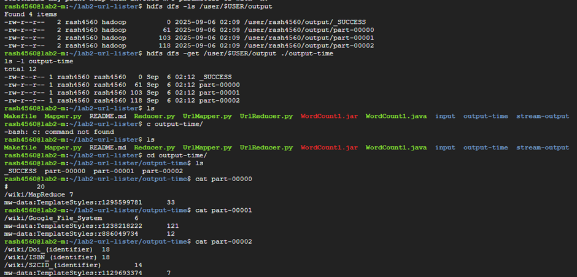

# EXPLAINATION OF CODE - 

## UrlMapper.py ->
    1. Has the regex pattern to identify the url from the file.
    2. Strip any blank spaces to get the perfect Url to compare to the regex. Also keep a       non-empty url check.
    3. Then read the input pages by line.
    4. Once url is found, print it in the form of the Hadoop mapreduce format so that it is easy to count the number of occurrencess.

## UrlReducer.py ->
    1. The output from mapper is used by the reducer to count the number of occurrences.
    2. The loop checks the previous and current url and increments the count if they match.
    3. Print only those urls whose counts are greater than 5.

## Makefile ->
    1. 1st change that I have done is change the add a different prepare-datadoc specifically for running on the cluster. It takes care of creating the input folder on the hdfs path and downloading the wikipedia files there.
    2. 2nd change is the stream-dataproc variable that helps to run the code on the cluster by deleting the previous output file and creaating a new one by calling the py files.
    
# Output - 

## Output folder for 2 nodes 1 master ->

As can be seen in the picture, there are 3 parts generated corresponding to the master and nodes. This is because of the parallel processing on all the nodes. Each node gives a separate output.

## Output folder for 4 nodes 1 master ->

You can see above a total of 7 files generated due to the parallel processing of all the nodes. Each node gives a particular output and together they constitute the overall urls expected as output from the wikipedia pages. 

# Time Comparison - 

## Time for 2 node cluster ->

## Time for 4 node cluster ->

By intuition, the cluster with 4 nodes should run faster than the cluster with 2 nodes. That is what I observed in the output as well. But the difference wasn't a lot at all (lesss than 1 sec). I believe this is because the input files were very small and addding to it the starting overhead for a 4 node cluster, the overall result is almost similar time taken by both the runs. If we increase the input volume by a significant margin, we might get the desired differences.

